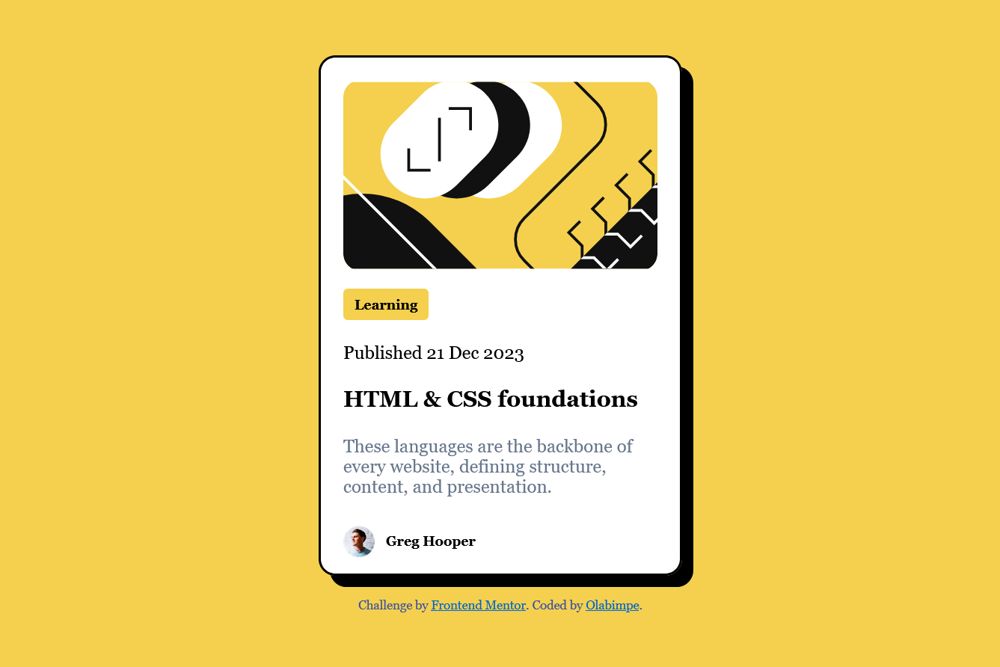

Welcome! 👋

Frontend Mentor - Blog preview card solution

This is a solution to the [Blog preview card challenge on Frontend Mentor](https://www.frontendmentor.io/challenges/blog-preview-card-ckPaj01IcS). Frontend Mentor challenges help you improve your coding skills by building realistic projects. 

Table of contents

- [Overview]
  - [The challenge]
  - [Screenshot]
  - [Links]
- [My process]
  - [Built with]
- [Author]

Overview

Screenshot

Links

- Solution URL: [https://github.com/Lapupeh/Blog-preview-card.git]
- Live Site URL: [https://stupendous-mousse-b4e702.netlify.app]

My process

Built with

- Semantic HTML5 markup
- CSS custom properties
- Flexbox
- CSS Grid
- Mobile-first workflow

Author

-Olabimpe Abesin
